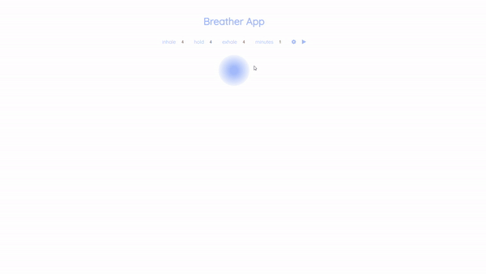

# Breather App

This is a single page web breather app using CSS, JS, and GreenSock animations; made for a MMED-6000 course assignment. 

You can try it out [here](nohakareem.github.io/breather-app/)

